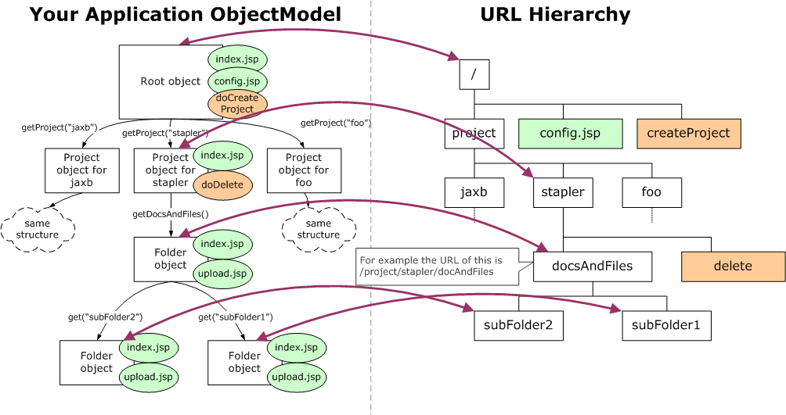

Stapler is a library that "staples" your application objects to URLs,
making it easier to write web applications. The core idea of Stapler is
to automatically assign URLs for your objects, creating an intuitive URL
hierarchy.

Normally, most of your JSP and servlet goes like this; first, you use
parameters and extra path info to locate the object to work with, then
use some more parameters and such to perform some operations against it
(or perhaps render HTML). Stapler takes care of this first portion by
dispatching requests to that object you'll be working with.

Suppose you are building a web application like the system of java.net,
where you got projects, mailing lists, documents and files section, and
etc. The following figure shows how Stapler works.

The left half shows your code. OOP lets you model those concepts
straight-forwardly into classes that refer to each other. Through
reflection, Stapler assigns URLs to your application objects. The root
of your application object gets the root URL `/`. The object you can
access with `root.getProject("stapler")` would be assigned to the URL
`/project/stapler`. In this way, your object model directly turns into
the URL hierarchy, as partially shown in purple arrows.

== JSPs and servlets

Most of the times JSPs are used to show an object in your application.
Stapler allows you to associate JSPs to your application classes, as
shown in green circles in the above figure. Stapler weaves those JSPs
into the URL hierarchy, and when they get requested, Stapler sets up the
environment such that they can access the corresponding application
object very easily, by the "it" variable (like $\{it.name}).

Similarly, often you want to run some Java code when a certain URL is
requested, as shown in red circles in the above figure. For example,
when `/project/stapler/delete` is requested, you'd like to delete the
project and redirect the user to `/`. With Stapler, this is as easy as
defining a method on your application objects. Stapler invokes the
method on the right object.

== Problems That Stapler Solves

Servlet (and technologies like JSP/JSF that builds on top of it) can
only bind request URLs into your static resources, JSPs, and/or servlets
in a very limited way. You can even tell that from the java.net system.
For example, the URL to view the archive of a mailing list is
`/servlets/SummarizeList?listName=announce`, the URL to search the
archive if `/servlets/SearchList?listName=announce`, and the URL to
manage it is `/servlets/MailingListEdit?list=announce`.

This has some problems.

=== Relative URLs are useless

Ordinary servlet/JSP prevents you from using the URL hierarchy to
organize your application. In the java.net system, if you want to
generate a link from the archive to the search page, you have to put the
whole URL including all the parameters. You'll be writing something like
`/servlets/SearchList?list=${listName}`. As your application gets more
complicated, the number of parameters will increase, making your
application harder and harder to maintain.

Stapler allows you to use URLs like `list/announce/summarize`,
`list/announce/search`, and `list/announce/edit`. Thus a link from the
summary page to the search is simply `search`.

=== A lot of boiler-plate code

Most of the times, the first thing your JSPs and servlets need to do is
to locate the object that you'll be working with. This is tedious. Even
worse, it needs to be repeated in many places.

Stapler takes care of this for you. When your JSP is invoked, you can
access the target object by the variable "it". Or when your action
method (the equivalent of the servlet) is invoked, it is invoked on the
target object. This cuts down a lot of boring boiler-plate code in your
application.

=== Recursive Structure

Servlets can't handle recursive directory structure very well. In the
above figure, I have recursive `Folder` class that has two JSPs each.
The only way to make this work in servlet is to assign unique IDs to
each folder and define those JSPs at the top-level. The actual URLs will
be very different from the natural tree structure.

Stapler maps this very naturally to URLs.
